# ProcuAsist - Manual de Usuario (v0.7.0)

## Índice

1. [Qué es ProcuAsist](#1-qué-es-procuasist)
2. [Instalación desde Chrome Web Store](#2-instalación-desde-chrome-web-store)
3. [Primer uso: PIN maestro y credenciales de los portales](#3-primer-uso-pin-maestro-y-credenciales-de-los-portales)
4. [La pestaña Causas](#4-la-pestaña-causas)
5. [Alertas](#5-alertas)
6. [Descargar un expediente completo](#6-descargar-un-expediente-completo)
7. [Importar causas en masa](#7-importar-causas-en-masa)
8. [Plazos](#8-plazos)
9. [Backup: exportar e importar tus datos](#9-backup-exportar-e-importar-tus-datos)
10. [Preguntas frecuentes y problemas comunes](#10-preguntas-frecuentes-y-problemas-comunes)
11. [Privacidad](#11-privacidad)
12. [Capturas pendientes](#12-capturas-pendientes)

---

## 1. Qué es ProcuAsist

### 1.1. Qué es una extensión de Chrome

Si nunca instalaste una extensión, pensala así: una extensión de Chrome no es un programa aparte que se abre por su cuenta, como Word o el sistema de gestión del estudio. Es un agregado que vive **adentro** del navegador Google Chrome y que aparece cada vez que vos ya estás navegando. No tiene un ícono propio en el escritorio de Windows ni en la barra de tareas: vive en Chrome, arriba a la derecha, al lado de donde escribís las direcciones web.

ProcuAsist es una extensión gratuita para abogados que litigan en la Provincia de Buenos Aires (MEV/SCBA), en el Poder Judicial de la Nación (PJN) y, de forma básica, en la Justicia de CABA (JUSCABA/EJE). Automatiza tareas repetitivas: iniciar sesión, guardar causas, avisar cuando hay movimientos nuevos, descargar el expediente completo y calcular plazos procesales.

Está hecha por un abogado de la matrícula, para colegas. Es gratuita, sin fines de lucro y no requiere crear ninguna cuenta: todo lo que guardás queda en tu propia computadora.

### 1.2. El ícono en la barra de Chrome y cómo "fijarlo"

Cuando instalás una extensión, Chrome no la muestra siempre visible: la esconde dentro de un menú con forma de pieza de rompecabezas (el ícono de "Extensiones"), arriba a la derecha de la ventana. Para no tener que abrir ese menú cada vez, conviene "fijar" el ícono de ProcuAsist para que quede siempre a la vista.

Cómo fijarlo:

1. Hacé clic en el ícono de pieza de rompecabezas (Extensiones), arriba a la derecha de Chrome.
2. Buscá "ProcuAsist - Copiloto Legal" en la lista.
3. Hacé clic en el ícono de alfiler (pin) que aparece al lado. Se pone de color y el ícono de ProcuAsist queda fijo en la barra, visible todo el tiempo.

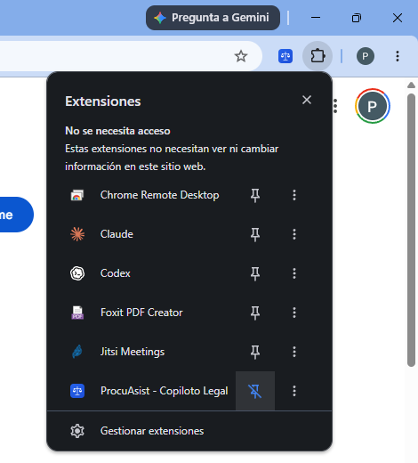

### 1.3. Qué es el panel lateral

ProcuAsist no funciona en una ventana propia: se muestra en el **panel lateral** de Chrome (el "side panel"), una franja angosta que se abre pegada al borde derecho de la ventana del navegador, sin taparte la página que estás mirando. Ahí adentro están las tres pestañas principales de ProcuAsist: **Causas**, **Plazos** y **Ajustes**.

Para abrir el panel lateral tenés dos caminos:

- Hacé clic en el ícono de ProcuAsist ya fijado en la barra de extensiones.
- O, si estás en una página de un expediente en MEV o en PJN, hacé clic en el botón **"Configurar"** de la botonera flotante que aparece en la esquina inferior derecha de la pantalla (ver punto 1.4).

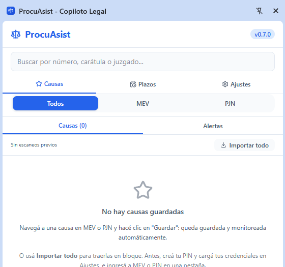

### 1.4. La botonera flotante en los portales judiciales

Cuando entrás a una causa en MEV o en el sistema de consultas web de PJN (SCW), ProcuAsist agrega una **botonera flotante**: un grupo pequeño de botones que aparece pegado a la esquina inferior derecha de la pantalla, por encima del contenido del portal. Desde ahí podés guardar la causa, descargar el expediente o abrir la configuración, sin salir de la página del portal.

Qué funciones tiene (según qué tan completo es el soporte del portal):

- **Guardar**: guarda la causa (y la deja monitoreada, ver punto 4).
- **ZIP** / descarga del expediente completo.
- **Importar** o **Importar set**: cuando estás en una página de resultados o de un set de búsqueda.
- **Configurar**: abre el panel lateral.

No es un botón único: es visualmente una columna de botones, cada uno con su función, y solo aparece en las páginas de causa o de resultados que ProcuAsist reconoce.

---

## 2. Instalación desde Chrome Web Store

1. Abrí Google Chrome (si no lo tenés, instalalo primero desde google.com/chrome; ProcuAsist solo funciona en Chrome, versión 120 o superior).
2. Entrá a la ficha de ProcuAsist en la Chrome Web Store: https://chromewebstore.google.com/detail/procuasist-copiloto-legal/dbkfeofoijnkclfpigimiodcccpjakem
3. Hacé clic en **"Agregar a Chrome"**.
4. Chrome va a mostrar un cuadro con los permisos que pide la extensión. Confirmá haciendo clic en **"Agregar extensión"**.
5. Vas a ver un aviso breve de que ProcuAsist se agregó. Fijá el ícono como se explica en el punto 1.2 para tenerlo siempre a mano.

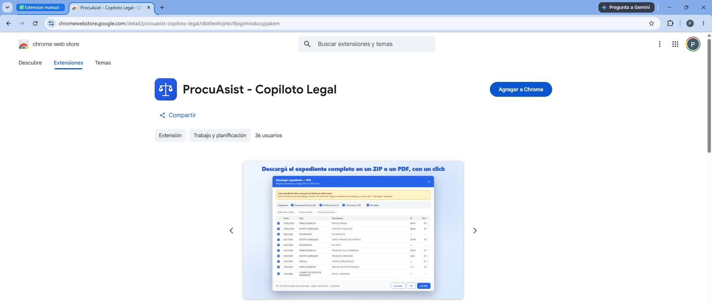

No hace falta reiniciar Chrome ni crear ninguna cuenta. Con la instalación ya está lista para configurarse.

---

## 3. Primer uso: PIN maestro y credenciales de los portales

La primera vez que abrís el panel lateral, ProcuAsist te muestra una bienvenida de 5 pantallas (onboarding) que explica brevemente qué hace la extensión, cómo funciona el guardado de causas, el monitoreo y la seguridad. Las primeras cuatro pantallas se pueden saltear con el botón **"Omitir"** si ya conocés la herramienta; la última, de términos de uso, no se puede saltear: hay que confirmarla con **"Acepto y comenzar"** para poder seguir usando la extensión. Este asistente es solo informativo: no te pide el PIN ni las credenciales de los portales en ningún momento, eso se configura después, desde Ajustes (ver 3.2 y 3.3).

### 3.1. Por qué hace falta un PIN

Para que ProcuAsist pueda iniciar sesión automáticamente en los portales judiciales, necesita guardar tu usuario y tu contraseña de esos portales. Guardarlos "en texto plano" sería un riesgo, así que ProcuAsist los cifra (con AES-256-GCM, el mismo tipo de cifrado que usan los bancos) y la única llave para abrir ese cifrado es un **PIN maestro** que elegís vos y que ProcuAsist no guarda en ningún servidor: existe solo en tu computadora.

**Importante y sin margen de vuelta atrás**: no existe ninguna función de "recuperar PIN". Si ya guardaste alguna credencial de portal, ProcuAsist no te deja configurar un PIN nuevo por encima del viejo: te va a pedir que uses "Desbloquear" con el PIN que ya tenías. Si te olvidaste ese PIN, no hay forma de recuperar las credenciales que tenías guardadas, porque nadie (ni el autor de ProcuAsist) puede desencriptarlas sin él. Lo que sí existe desde la 0.7.0 es un flujo de **"Restablecer PIN"** (ver 3.5): borra el PIN y las credenciales guardadas, y te deja empezar de nuevo **sin perder** tus causas, alertas ni plazos. Igual conviene anotar el PIN en un lugar seguro (por ejemplo, tu gestor de contraseñas habitual) antes de perderlo de vista: restablecer implica volver a cargar las credenciales de todos los portales a mano.

### 3.2. Configurar el PIN

1. Abrí el panel lateral y andá a la pestaña **Ajustes**.
2. Hacé clic en **"Configuración avanzada"**. Se abre la página de opciones de ProcuAsist en una pestaña nueva.
3. En la sección **Credenciales**, vas a ver el bloque **"PIN Maestro"**.
4. Escribí un PIN de **4 a 8 dígitos** (solo números) y confirmalo en el segundo campo.
5. Hacé clic en **"Configurar PIN"**.

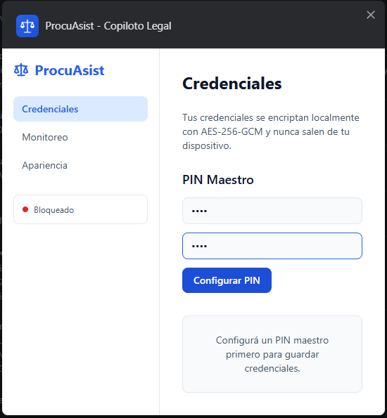

### 3.3. Guardar las credenciales de los portales

Una vez que el PIN está configurado y desbloqueado, en la misma página de opciones aparecen los formularios de credenciales de cada portal. **Son las mismas credenciales que ya usás para entrar manualmente a esos portales**, no hay que crear ningún usuario nuevo:

- **MEV**: tu usuario y tu contraseña de mev.scba.gov.ar (Mesa de Entradas Virtual, Provincia de Buenos Aires).
- **PJN**: tu usuario y tu contraseña del inicio de sesión único (SSO) del Poder Judicial de la Nación, el mismo que usás para entrar a scw.pjn.gov.ar o portalpjn.pjn.gov.ar.

Para cada portal: completá usuario y contraseña, y hacé clic en **"Guardar Credenciales"**. Un aviso confirma "Credenciales guardadas y encriptadas".

Estas credenciales **quedan cifradas exclusivamente en tu computadora**. ProcuAsist no tiene servidores propios para la versión gratuita: nunca viajan a internet, ni siquiera a un servidor del autor.

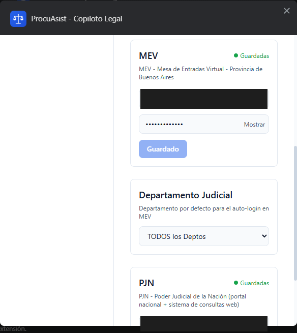

En esa misma página, debajo de las credenciales de MEV, hay un selector de **Departamento Judicial**: elegí el departamento donde más litigás (La Plata, Mar del Plata, Avellaneda, etc.) para que el ingreso automático a MEV lo complete solo.

### 3.4. Mantener la sesión desbloqueada (opcional)

Por defecto, cada vez que Chrome reinicia el proceso interno de la extensión (algo que pasa solo, después de un rato de inactividad), ProcuAsist te va a volver a pedir el PIN antes de poder usar el auto-login. Si preferís no tener que reingresarlo tan seguido, en la pestaña Ajustes del panel lateral hay un interruptor **"Mantener sesión iniciada (no pedir PIN)"**. Es más cómodo, pero también menos seguro: la clave queda guardada en ese perfil de Chrome mientras el interruptor esté activado. Si compartís la computadora con alguien, es preferible dejarlo apagado.

### 3.5. Si te olvidaste el PIN: restablecer

En la misma página de opciones (Ajustes, "Configuración avanzada", sección Credenciales) hay un bloque **"Restablecer PIN"**, disponible incluso con el vault bloqueado, que es justamente la situación de quien olvidó su PIN.

Qué hace y qué no hace, sin vueltas:

- **Borra** el PIN actual y **todas las credenciales de portales guardadas** (MEV, PJN). No es una recuperación: sin el PIN anterior esas credenciales son indescifrables para siempre, así que borrarlas y empezar de nuevo es el único camino.
- **No toca** tus causas guardadas, los monitoreos, las alertas ni los plazos: todo eso sigue intacto.
- Después del restablecimiento podés configurar un PIN nuevo y volver a cargar las credenciales de cada portal a mano (ver 3.2 y 3.3).

El flujo pide **dos confirmaciones** seguidas, con el detalle explícito de lo que se borra, antes de ejecutar nada. Si cancelás en cualquiera de las dos, no se borra nada.

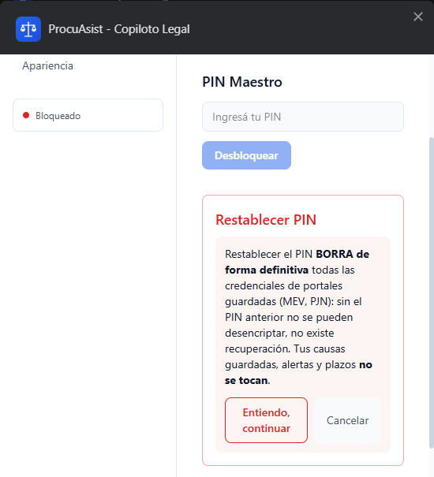

---

## 4. La pestaña Causas

Desde la 0.7.0, ya no existen pestañas separadas de "Marcadores" y "Monitoreo": las dos se unificaron en una sola pestaña llamada **Causas**. La idea de fondo es simple: **guardar una causa es lo mismo que empezar a monitorearla**. No hay un paso extra para activar avisos: en el momento en que guardás una causa, ProcuAsist ya la revisa periódicamente por vos.

### 4.1. Guardar una causa desde MEV o desde PJN

1. Navegá hasta la página de una causa puntual en MEV o en PJN/SCW (no en un listado de resultados).
2. ProcuAsist detecta los datos de la causa automáticamente y muestra la botonera flotante.
3. Hacé clic en **"Guardar"**.
4. La causa queda guardada y monitoreada: aparece de inmediato en la pestaña Causas del panel lateral.

También podés guardar una causa recién detectada desde el panel lateral: si acabás de abrir una causa en el portal, en la parte superior de la pestaña Causas aparece un aviso "Causa detectada en MEV/PJN" con un botón para agregarla sin volver a la pestaña del portal.

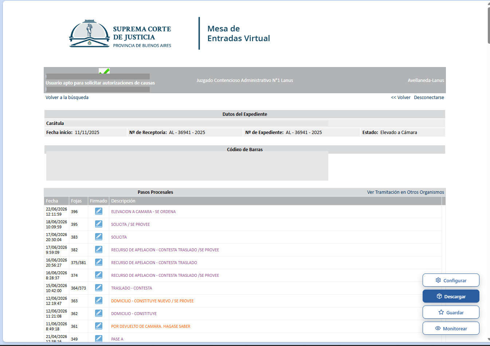

### 4.2. Buscar causas guardadas

En la parte superior del panel lateral hay un buscador que filtra por **número de expediente, carátula o juzgado**. Debajo del buscador hay un filtro rápido por portal (Todos / MEV / PJN).

### 4.3. Qué significa cada estado en la tarjeta de una causa

Cada causa guardada se muestra en una tarjeta con:

- El **portal** de origen (MEV, PJN o EJE), el número de expediente y la carátula.
- Un badge **"Avisos pausados"** si pusiste el monitoreo en pausa para esa causa.
- Un badge **"Sin escaneo"** en algunos casos de MEV: pasa cuando la causa se guardó sin los identificadores internos que el escaneo automático necesita para funcionar. Se soluciona abriendo la causa una vez más directamente en MEV.
- Un badge rojo **"NOVEDAD"** cuando hay alertas nuevas sin leer para esa causa.
- El juzgado y la fecha del último escaneo, o del último movimiento conocido.

### 4.4. Pausar, reanudar y eliminar una causa

Cada tarjeta tiene un menú de opciones (el ícono de los tres puntos, visible al pasar el mouse por encima de la tarjeta) con estas acciones:

- **Abrir en portal**: abre la causa directamente en MEV o PJN.
- **Copiar carátula**: copia el número y el título al portapapeles.
- **Pausar avisos** / **Reanudar avisos**: pausar detiene las notificaciones de esa causa puntual sin borrar nada; reanudar las vuelve a activar. Es la forma de "silenciar" una causa que ya no te interesa seguir de cerca sin perder el historial.
- **Eliminar causa**: es una única acción que borra, en cascada, el marcador, el monitoreo y todas las alertas asociadas a esa causa. No hay forma de deshacerlo desde la extensión.

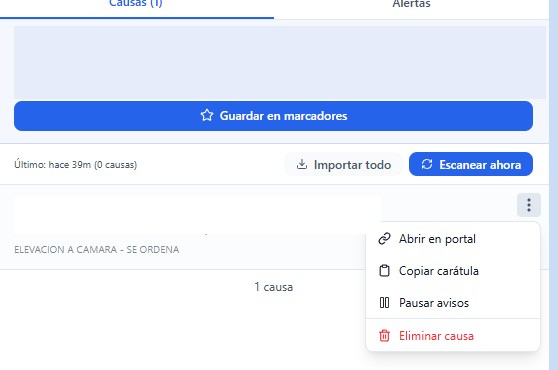

### 4.5. Escanear ahora y el escaneo rápido por sets (beta)

Además del escaneo automático en segundo plano, en la pestaña Causas hay un botón **"Escanear ahora"** para forzar una revisión inmediata de todas las causas visibles, sin esperar al próximo ciclo automático.

Desde la 0.7.0, el escaneo automático de MEV puede usar un atajo: si tenés **sets de búsqueda** guardados en tu cuenta de la MEV, ProcuAsist consulta la búsqueda de "novedades de set" del propio portal en una sola pasada y solo revisa causa por causa las que efectivamente se movieron. Las causas monitoreadas que no están en ningún set se siguen revisando una por una, como siempre.

Sobre este modo, tres aclaraciones prudentes:

- Está marcado **(beta)** y viene **desactivado de fábrica**: el escaneo normal (causa por causa) es el que corre por defecto. Si querés probar el atajo, lo activás desde Ajustes con el interruptor **"Escaneo rápido por novedades de set (beta)"**, y si algo no te cierra lo apagás y el escaneo vuelve al modo completo.
- Ante cualquier falla del portal, ProcuAsist abandona el atajo solo y escanea todo causa por causa; además, al menos una vez por día hace un barrido completo aunque el atajo esté funcionando.
- El botón **"Escanear ahora" siempre revisa causa por causa**, sin atajo: es tu forma de verificar todo cuando tengas dudas.

---

## 5. Alertas

Dentro de la pestaña Causas hay una sub-pestaña **Alertas**, al lado de la lista de causas, con su propio contador de novedades.

### 5.1. Cómo se leen las alertas

A diferencia de versiones anteriores, las alertas se muestran **agrupadas por expediente**: una sola tarjeta por causa, con su movimiento más reciente, en vez de una tarjeta por cada movimiento suelto. Si una causa tuvo varios movimientos nuevos, la tarjeta lo aclara ("N movimientos registrados, abrí la causa para ver todo").

Los contadores de novedades (en la pestaña principal, en la sub-pestaña Alertas y en cada tarjeta) cuentan **expedientes con novedades**, no movimientos sueltos: si una misma causa tuvo tres movimientos nuevos, cuenta como una sola novedad, no como tres.

### 5.2. Qué significa NOVEDAD

El badge rojo **NOVEDAD** aparece en una causa (y en su tarjeta de alerta) cuando tiene al menos un movimiento detectado que todavía no marcaste como leído.

### 5.3. Marcar alertas como leídas

- Hacé clic directamente sobre la tarjeta de una alerta: se abre la causa en el portal y, de paso, se marcan como leídas todas las alertas de esa causa.
- O hacé clic en el enlace **"Marcar como leída"** dentro de la tarjeta, sin necesidad de abrir el portal.
- Si tenés varias causas con novedades, arriba de la lista hay un botón **"Marcar todas como leídas"** para limpiarlas todas de una vez.

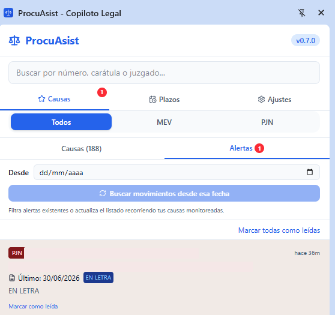

### 5.4. Buscar movimientos desde una fecha

En la sub-pestaña Alertas hay un campo **"Desde"** donde podés indicar una fecha. Al elegirla, la lista se filtra para mostrar solo alertas de esa fecha en adelante. Además, el botón **"Buscar movimientos desde esa fecha"** ejecuta un barrido activo: recorre tus causas monitoreadas buscando movimientos nuevos a partir de esa fecha puntual, en vez de esperar al próximo escaneo automático. Al terminar, un mensaje informa cuántos movimientos encontró.

Este barrido necesita que tengas una pestaña abierta y con sesión activa del portal correspondiente (ver la sección de problemas comunes, punto 10).

---

## 6. Descargar un expediente completo

### 6.1. MEV: ZIP con resumen o PDF único

1. Navegá a la página de una causa en MEV.
2. En la botonera flotante, hacé clic en el botón de descarga del expediente.
3. Se abre una ventana **"Seleccionar pasos procesales a descargar"**: lista todos los pasos procesales de la causa, con fecha, fojas y una descripción breve de cada uno (y un indicador "Firm." en los que están firmados).
4. Por defecto están **todos los pasos marcados**. Podés desmarcar los que no te interesan, o usar los botones **"Seleccionar todos"** / **"Deseleccionar todos"**.
5. Al pie de la ventana hay dos botones de descarga, que muestran cuántos pasos vas a incluir:
   - **"ZIP (N)"**: genera un archivo ZIP con un `resumen.pdf` (una tabla con todos los movimientos) más un PDF individual por cada paso procesal seleccionado, más los adjuntos de cada paso.
   - **"Un PDF (N)"**: genera un único PDF que junta todo (resumen y pasos seleccionados) en un solo archivo, para quien prefiera no manejar un ZIP.
6. Si hacés clic en "Cancelar" sin seleccionar nada, no se descarga nada.

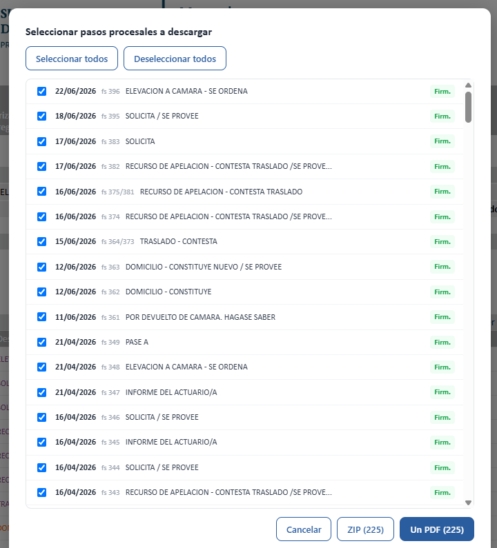

La descarga puede tardar varios minutos en expedientes grandes, porque ProcuAsist tiene que abrir cada paso procesal, convertirlo a PDF y bajar sus adjuntos uno por uno. Si algún documento o adjunto falla, el ZIP se completa igual y queda un archivo `_verificacion.txt` con el detalle de qué no se pudo descargar. A diferencia de la descarga de PJN (ver 6.2), la descarga de MEV no tiene un botón para cancelarla a mitad de camino: si te arrepentís, hay que esperar a que termine.

### 6.2. PJN: ZIP desde SCW, con timeout y cancelar

1. Navegá a la página de un expediente en scw.pjn.gov.ar.
2. En la botonera flotante, hacé clic en el botón de descarga del expediente.
3. Se abre un modal con la tabla completa de actuaciones, con casilleros para marcar cuáles incluir y filtros por categoría del propio portal (Despachos/Escritos, Notificaciones, Información, o "Ver todos").
4. Confirmá la selección para generar el ZIP.

Diferencias importantes respecto de MEV:

- Cada documento tiene un **límite de 45 segundos** para descargarse. Si el servidor del SCW se cuelga con un documento puntual, ProcuAsist corta ese documento a los 45 segundos, lo deja registrado como error y sigue con el resto sin romper el ZIP completo.
- Mientras la descarga está en curso, hay un botón **"Cancelar descarga"** disponible para frenar todo el proceso si te arrepentís o si se está haciendo demasiado largo.

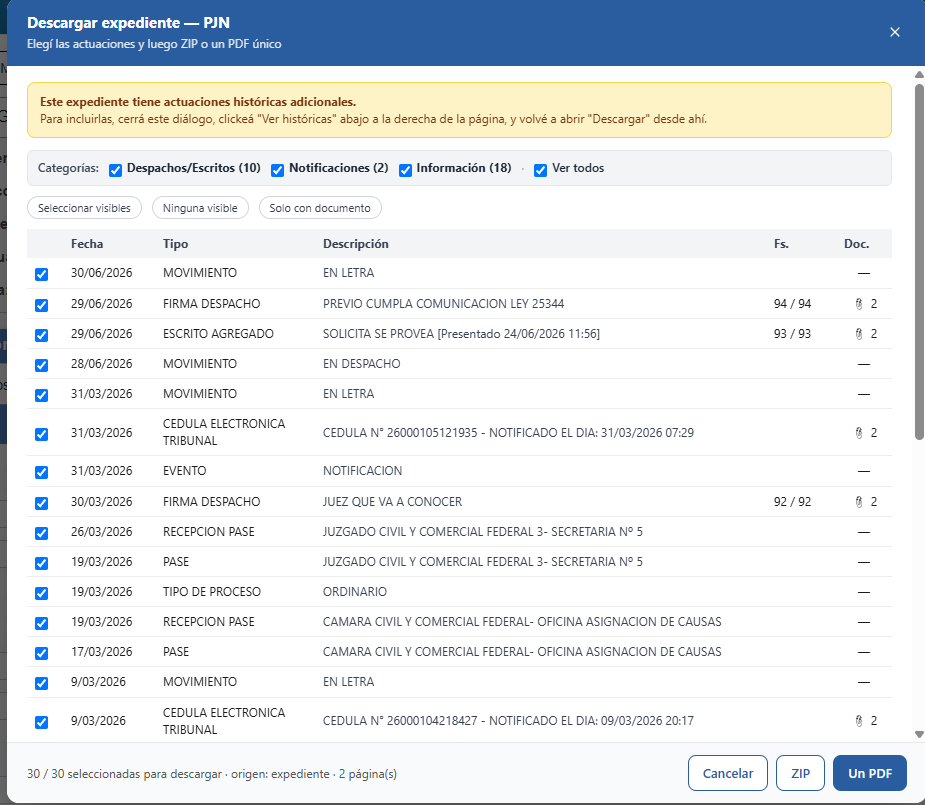

---

## 7. Importar causas en masa

### 7.1. Desde resultados MEV

1. Hacé una búsqueda de causas en MEV (por ejemplo, por letrado o por juzgado).
2. En la botonera flotante de la página de resultados aparece el botón **"Importar"**.
3. ProcuAsist recorre automáticamente todas las páginas de resultados (hasta 15) antes de mostrarte el modal de selección.
4. Elegí qué causas importar y confirmá: cada causa importada queda guardada y monitoreada, igual que si la hubieras guardado una por una.

### 7.2. Desde un set de búsqueda MEV, incluido el diálogo multi-departamento

Cuando estás en la página de un **set de búsqueda guardado**, el botón dice **"Importar set"** en lugar de "Importar". Un set puede abarcar un solo departamento judicial o varios a la vez. Si el set abarca más de un departamento, antes de arrancar aparece un cuadro:

> "Importar set de búsqueda: este set abarca N departamentos judiciales. ¿Querés importar solo el departamento actual o recorrer el set completo? (Recorrer todos puede tardar varios minutos.)"

Con tres opciones:

- **"Todos los departamentos (N)"**: recorre el set completo, departamento por departamento y organismo por organismo, cambiando de departamento en automático.
- **"Solo este departamento"**: importa únicamente los organismos del departamento en el que ya estás.
- **"Cancelar"**: no importa nada.

Elegir "Todos los departamentos" puede demorar varios minutos si el set es grande: ProcuAsist va mostrando en la botonera en qué organismo y departamento va ("Importando set (organismo X/Y, N causas)...").

### 7.3. Desde listados PJN: relacionados o favoritos

1. En scw.pjn.gov.ar, andá al listado de causas **Relacionados** (letrado/parte) o **Favoritos**.
2. Hacé clic en **"Importar"** en la botonera flotante.
3. El portal de PJN pagina los resultados con su propio sistema (RichFaces); ProcuAsist recorre automáticamente **todas las páginas del listado**, no solo la que estás viendo.
4. Al terminar de recolectar, el modal te avisa cuántas páginas recorrió, con un texto del estilo: "Se recolectaron N página(s) del listado. Las causas importadas también se agregan al monitoreo." Ahí elegís cuáles importar.

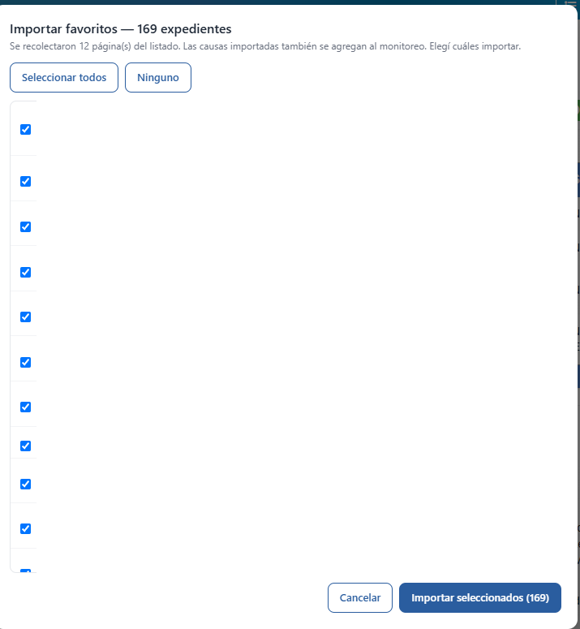

### 7.4. El asistente "Importar todo"

Si recién instalás ProcuAsist y querés traer **todas** tus causas de una sola vez, no hace falta ir portal por portal: en la pestaña Causas, junto al estado de escaneo, está el botón **"Importar todo"**, que abre un asistente de tres pasos.

**Antes de empezar**: dejá abiertas y con sesión iniciada las pestañas de los portales que quieras importar (mev.scba.gov.ar y/o scw.pjn.gov.ar). El asistente trabaja sobre esas pestañas; si no hay pestaña o la sesión está vencida, te lo va a decir y vas a poder reintentar la detección.

**Paso 1 - Detección y conteo.** El asistente detecta qué portales tienen sesión activa. Para PJN estima cuántas causas hay en Relacionados y en Favoritos (navega tu pestaña de SCW entre ambos listados para leer el paginador; los números son aproximados). Para MEV lista tus sets de búsqueda guardados, sin contarlos: los sets se cuentan al importar.

**Paso 2 - Selección.** Elegís con casilleros qué importar: Relacionados de PJN, Favoritos de PJN y cada set de MEV. Antes de ejecutar, el asistente te muestra la consecuencia anti-ruido: si el total de causas nuevas importadas supera un **umbral configurable** (50 por defecto, editable en Ajustes como "Umbral de pausa al importar en masa"), todas las causas nuevas de esa corrida entran guardadas pero **con los avisos pausados**, para que cientos de causas no te inunden el panel de alertas. Después activás el monitoreo solo de las que te interesan, desde el menú de cada tarjeta. Por debajo del umbral, las causas quedan con monitoreo activo normal.

**Paso 3 - Ejecución.** El asistente muestra el progreso fuente por fuente (páginas recorridas en PJN, organismos y departamentos en MEV). Podés **cancelar** en cualquier momento: el recorrido corta limpio entre páginas u organismos y el resumen refleja lo importado hasta ahí. También podés cerrar el panel lateral: la importación sigue en segundo plano y al reabrir el asistente retoma el progreso. Al final, un resumen indica cuántas causas se importaron, cuántas ya existían (los duplicados se saltean solos) y si hubo errores.

La importación de PJN recorre el listado con pausas de cortesía entre páginas para no castigar al portal; un set grande de MEV que abarca varios departamentos puede tardar varios minutos. Es esperable: el asistente avisa y sigue solo.

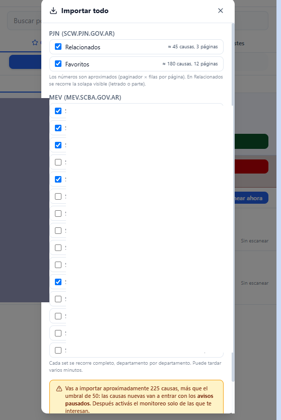

---

## 8. Plazos

La pestaña **Plazos** del panel lateral es una calculadora de plazos procesales en días hábiles judiciales, con lista de vencimientos, avisos y exportación a calendario.

### 8.1. Calcular un plazo

En la parte superior de la pestaña hay un formulario **"Calcular plazo"** que pide:

- **Qué vence** (una descripción libre, por ejemplo "Contestar demanda").
- **Expediente** (opcional).
- **Fecha de notificación**.
- **Cantidad de días**.
- **Tipo de plazo**: "Hábiles" o "Corridos".

A medida que completás los datos, se muestra una vista previa con la fecha exacta de vencimiento y la fecha del "plazo de gracia" (las primeras horas del despacho del día hábil siguiente al vencimiento). Hacé clic en **"Agregar plazo"** para sumarlo a tu lista de vencimientos.

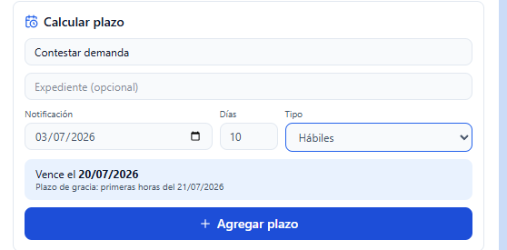

### 8.2. Días hábiles, feriados y ferias

El cómputo de días hábiles descuenta automáticamente sábados, domingos y los feriados nacionales argentinos, que ya vienen cargados para **2026 y 2027**. También trae precargada la feria judicial de enero de ambos años.

Los feriados que se trasladan por decreto y las ferias de invierno (julio) **no vienen cargados de fábrica**, porque varían según el año y la jurisdicción: hay que agregarlos a mano. Para eso, dentro de la pestaña Plazos hay una sección desplegable **"Ferias y días inhábiles"** donde podés cargar rangos de fechas personalizados (desde, hasta y una etiqueta), por ejemplo la feria de julio o un asueto local de tu jurisdicción.

**El cálculo es una ayuda, no un reemplazo del cómputo manual del plazo ni del control profesional del abogado.** No confirma feriados provinciales ni cambios de último momento en el calendario judicial.

### 8.3. Lista de vencimientos y avisos

Cada plazo cargado aparece en una lista con un badge de urgencia (VENCIDO, HOY, cantidad de días restantes, o "Cumplido" si ya lo marcaste como hecho). Podés marcar un plazo como cumplido, revertirlo o eliminarlo desde la misma lista.

ProcuAsist te avisa con una notificación de Chrome **3 días antes** del vencimiento, **el día del vencimiento** y **al vencer**, siempre que Chrome esté abierto en esas fechas.

### 8.4. Exportar a calendario (.ics)

El botón **"Exportar a calendario (.ics)"** descarga un archivo con todos tus plazos pendientes como eventos de día completo, cada uno con una alarma programada un día antes. Ese archivo se puede importar en Google Calendar, Outlook o cualquier otro calendario que acepte formato .ics, para tener tus vencimientos también ahí.

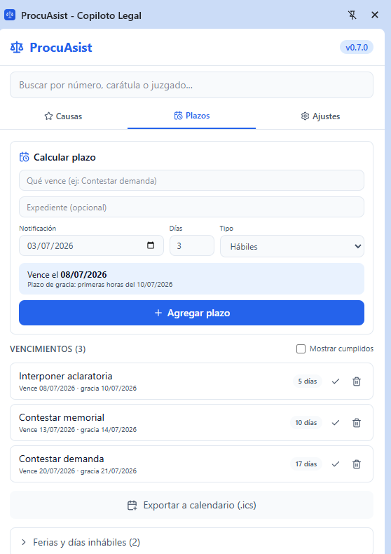

---

## 9. Backup: exportar e importar tus datos

En la pestaña **Ajustes** del panel lateral, en la sección **Datos**, hay dos botones: **"Exportar datos"** e **"Importar datos"**.

### 9.1. Qué incluye el backup

El archivo que se descarga (un .json) incluye tus causas guardadas, los monitores, las alertas, los plazos, los días inhábiles personalizados que cargaste y tus preferencias generales.

### 9.2. Qué NO incluye, nunca

**El backup nunca incluye tus credenciales de los portales ni tu PIN.** Es intencional: ese material sensible no sale de tu computadora bajo ninguna circunstancia, ni siquiera en un archivo de resguardo. Si pasás tus datos a otra computadora con este backup, vas a tener que volver a cargar el PIN y las credenciales de los portales ahí.

### 9.3. Cómo se importa: es un agregado, no un reemplazo

Al importar un archivo de backup, ProcuAsist **agrega** lo que trae el archivo sin borrar nada de lo que ya tenías guardado, y evita duplicar causas, alertas o rangos de fechas que ya existían. Si el archivo no es un backup válido de ProcuAsist, o está vacío o dañado, la importación falla con un mensaje de error y no toca tus datos existentes.

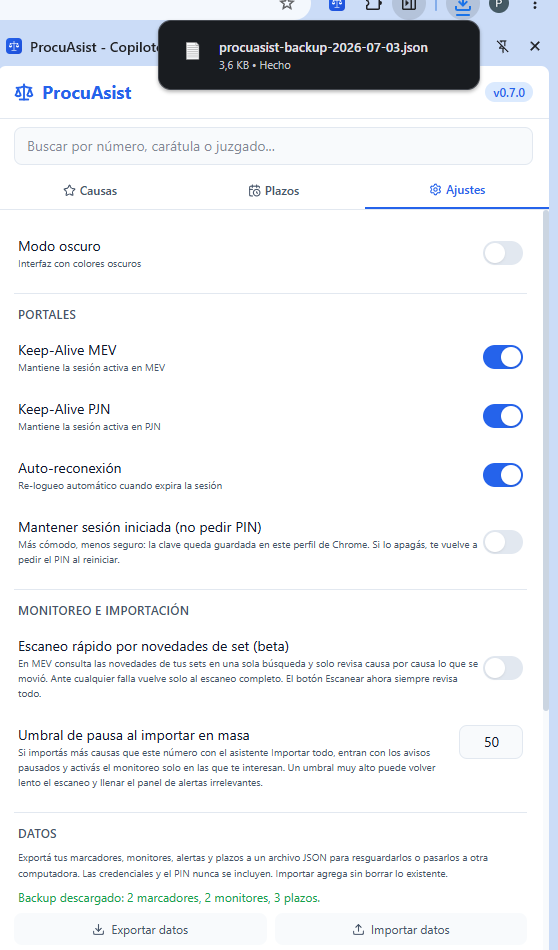

---

## 10. Preguntas frecuentes y problemas comunes

### Me olvidé el PIN. ¿Cómo lo recupero?

No se puede recuperar: sin el PIN correcto, las credenciales cifradas quedan inaccesibles para siempre, incluso para el autor de ProcuAsist. Lo que sí podés hacer es **restablecerlo** (ver 3.5): en Ajustes, "Configuración avanzada", sección Credenciales, el bloque "Restablecer PIN" borra el PIN y las credenciales guardadas (con doble confirmación previa) y te deja configurar un PIN nuevo. Tus causas guardadas, alertas y plazos no se pierden; las credenciales de los portales las vas a tener que cargar de nuevo a mano.

Ya no hace falta desinstalar y reinstalar la extensión como en versiones anteriores.

### La sesión del portal venció. ¿Qué hace ProcuAsist?

Si tenías la auto-reconexión activada (interruptor en Ajustes) y el PIN ya estaba desbloqueado, ProcuAsist detecta que te mandaron de vuelta a la pantalla de login y vuelve a entrar solo con tus credenciales guardadas, sin que tengas que hacer nada. Si el PIN nunca se desbloqueó en esa sesión de Chrome, o no hay credenciales guardadas para ese portal, en cambio, te llega una notificación de Chrome avisando que la sesión expiró y pidiéndote reingresar el PIN para poder reconectar.

### El escaneo de monitoreo no encuentra movimientos nuevos

Depende del portal:

- **En MEV**, el escaneo automático necesita sí o sí que tengas **una pestaña de mev.scba.gov.ar abierta** en ese momento, con sesión iniciada. Sin eso, no hay forma de que ProcuAsist consulte el portal, y esas causas no se revisan. Si pasó mucho tiempo sin pestañas de MEV abiertas, vas a recibir una notificación pidiéndote que abras MEV e inicies sesión. Si tenés activado el escaneo rápido por sets (ver 4.5) y sospechás que se está perdiendo algo, usá "Escanear ahora" (que siempre revisa causa por causa) o apagá el modo beta en Ajustes.
- **En PJN**, el escaneo funciona por lo general a través del sistema de novedades del propio portal, sin necesitar una pestaña abierta. Solo cuando ese sistema falla (por ejemplo, si la sesión de PJN venció del todo), ProcuAsist recurre a un respaldo que sí necesita una pestaña abierta del listado de causas en SCW (Relacionados o Favoritos) con sesión activa.

Lo mismo aplica al barrido "Buscar movimientos desde esa fecha" de la sección Alertas: si aparece el mensaje "Abrí el portal correspondiente con sesión activa y probá nuevamente", es por esta misma razón.

### No me aparece el botón flotante en el portal

Puede pasar por varias razones:

- Estás en una página que ProcuAsist no reconoce como página de causa, de resultados o de expediente (por ejemplo, la portada del portal).
- La sesión del portal no está iniciada.
- La extensión no llegó a cargar en esa pestaña: probá recargar la página (F5).
- Verificá en `chrome://extensions` que ProcuAsist está habilitada.

### Guardé una causa de MEV y dice "Sin escaneo"

Pasa cuando la causa se guardó sin ciertos identificadores internos del portal que el escaneo automático necesita para funcionar (por ejemplo, si se guardó desde un listado en lugar de desde la página propia de la causa). Se soluciona entrando una vez a esa causa directamente en MEV: al detectarla de nuevo, ProcuAsist completa esos datos y el escaneo pasa a funcionar con normalidad.

### El ZIP o el PDF de PJN se corta con un documento

El límite es de 45 segundos por documento. Si el servidor del SCW tarda más que eso en responder, ese documento puntual queda registrado como error (sin romper el resto del expediente) y podés reintentarlo más tarde. Durante la generación, también podés usar el botón "Cancelar descarga" si preferís frenar todo el proceso.

### Cambié de computadora, ¿pierdo mis causas guardadas?

Si hiciste un backup (ver punto 9) antes de cambiar, no: exportá el JSON en la computadora vieja e importalo en la nueva. Vas a tener que volver a configurar el PIN y las credenciales en la computadora nueva, porque esos datos nunca viajan en el backup.

### ¿Funciona en otro navegador que no sea Chrome?

Por el momento, solo está pensada y probada para Google Chrome 120 o superior. Otros navegadores basados en Chromium podrían funcionar parcialmente, pero no están soportados.

### Activé el modo oscuro pero el portal (MEV, PJN) se sigue viendo claro

Es esperable: el interruptor de modo oscuro de ProcuAsist (en Ajustes) cambia la apariencia del panel lateral, el popup y la página de opciones de la extensión. No cambia el diseño de las páginas de MEV, PJN o JUSCABA en sí, que siguen mostrándose con los colores propios de cada portal.

---

## 11. Privacidad

ProcuAsist funciona enteramente en tu computadora: no hay backend propio para la versión gratuita ni servidores del autor que reciban tus datos. Tus causas, alertas, plazos y credenciales cifradas se guardan únicamente en el almacenamiento local de Chrome, en tu perfil de usuario.

Las credenciales de los portales se cifran con AES-256-GCM y la llave para desencriptarlas se deriva de tu PIN: sin el PIN correcto, nadie puede leerlas, ni siquiera el autor de la extensión.

ProcuAsist es una herramienta complementaria: no reemplaza el control manual de las actuaciones judiciales ni el criterio profesional del abogado. Se ofrece "tal cual", sin garantías de ningún tipo.

Para más detalle, ver el archivo `PRIVACY.md` del proyecto.

---

## 12. Capturas pendientes

Guion completo de la sesión de capturas de pantalla para este manual, en orden:

1. `tutorial/01-fijar-icono.png` - Menú de extensiones de Chrome con la pieza de rompecabezas abierta y el alfiler de ProcuAsist marcado.
2. `tutorial/02-panel-lateral.png` - Panel lateral abierto mostrando las tres pestañas Causas, Plazos y Ajustes.
3. `tutorial/03-instalar-cws.png` - Ficha de ProcuAsist en Chrome Web Store con el botón "Agregar a Chrome".
4. `tutorial/04-configurar-pin.png` - Página de opciones, sección Credenciales, con los campos de PIN y confirmación de PIN.
5. `tutorial/05-guardar-credenciales.png` - Formularios de credenciales de MEV y PJN completos, con el aviso "Credenciales guardadas y encriptadas".
6. `tutorial/06-restablecer-pin.png` - Bloque "Restablecer PIN" en la página de opciones, con el primer aviso de confirmación visible.
7. `tutorial/07-guardar-causa.png` - Botón "Guardar" en la botonera flotante sobre una causa de MEV.
8. `tutorial/08-menu-causa.png` - Tarjeta de una causa con el menú de opciones desplegado (Abrir, Copiar carátula, Pausar avisos, Eliminar causa).
9. `tutorial/09-alertas.png` - Sub-pestaña Alertas con varias tarjetas agrupadas por causa, alguna con badge NOVEDAD.
10. `tutorial/10-modal-zip-mev.png` - Modal "Seleccionar pasos procesales a descargar" con la lista de movimientos y los botones ZIP / Un PDF.
11. `tutorial/11-modal-zip-pjn.png` - Modal de descarga ZIP de PJN con la tabla de actuaciones y el botón Cancelar descarga visible durante la generación.
12. `tutorial/12-dialogo-multidepartamento.png` - Cuadro de diálogo "Importar set de búsqueda" con las opciones Todos los departamentos / Solo este departamento / Cancelar.
13. `tutorial/13-importar-pjn-multipagina.png` - Modal de importación PJN mostrando cuántas páginas se recolectaron y la lista de causas para elegir.
14. `tutorial/14-importar-todo.png` - Asistente "Importar todo" en el paso de selección, con las fuentes detectadas, los estimados y el aviso del umbral de pausa.
15. `tutorial/15-calcular-plazo.png` - Formulario "Calcular plazo" con la vista previa de fecha de vencimiento y plazo de gracia.
16. `tutorial/16-plazos-vencimientos.png` - Pestaña Plazos completa, con la lista de vencimientos y el botón Exportar a calendario.
17. `tutorial/17-backup.png` - Sección Datos en Ajustes con los botones Exportar datos e Importar datos y un mensaje de resultado de la importación.

Todas las capturas deben ir anonimizadas (sin carátulas ni datos reales de clientes).

---

## Contacto y soporte

- **Mail**: blancoilariasistente@gmail.com
- **GitHub**: https://github.com/blancoilari/procu-asist/issues

*ProcuAsist v0.7.0 - Copiloto Legal para Abogados Argentinos*
